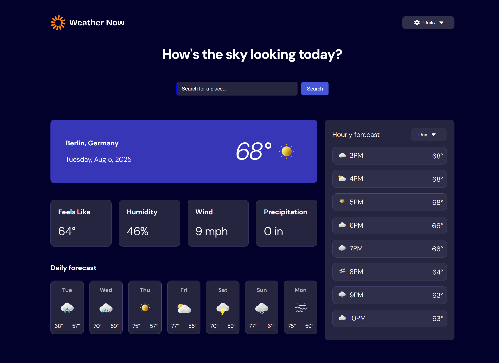

<h1 align="center">React-ex-weather-app-main</h1>

###

  
  
  
  
  
  
  
  
  

###

N.b. L'esercizio in questione era finalizzato ad imparare meglio React.  L'esercizio richiedeva anche un Responsive (che al momento non ho fatto e rimedierò in futuro) e, soprattutto, L'utilizzo di una API che non sono riuscito ad integrare al meglio e non ero sicuro del suo costo effettivo.   Ho creato quindi una pagina statica, con l'aggiunta di due menu a tendina, e in futuro voglio cambiare i valori a seconda della selezione.   Per ora pubblico il mio risultato provvisorio  
  
    
  
  📝 Brief This challenge is part of the Frontend Mentor 30-Day Hackathon with submissions closing on Monday, October 6th. Find hackathon details here. During the hackathon, this challenge is free+ (everyone gets free Figma access) and will revert to free after.  Your challenge is to build this weather app using the Open-Meteo API and make it look as close to the design as possible.  You can use any tools you like to help you complete the challenge. So, if you have something you'd like to practice, feel free to give it a try.  Your users should be able to:  Search for weather information by entering a location in the search bar View current weather conditions, including temperature, weather icon, and location details See additional weather metrics like "feels like" temperature, humidity percentage, wind speed, and precipitation amounts Browse a 7-day weather forecast with daily high/low temperatures and weather icons View an hourly forecast showing temperature changes throughout the day Switch between different days of the week using the day selector in the hourly forecast section Toggle between Imperial and Metric measurement units via the units dropdown Switch between specific temperature units (Celsius and Fahrenheit) and measurement units for wind speed (km/h and mph) and precipitation (millimeters) via the units dropdown View the optimal layout for the interface depending on their device's screen size See hover and focus states for all interactive elements on the page

###

# React + Vite

This template provides a minimal setup to get React working in Vite with HMR and some ESLint rules.

Currently, two official plugins are available:

- [@vitejs/plugin-react](https://github.com/vitejs/vite-plugin-react/blob/main/packages/plugin-react) uses [Babel](https://babeljs.io/) (or [oxc](https://oxc.rs) when used in [rolldown-vite](https://vite.dev/guide/rolldown)) for Fast Refresh
- [@vitejs/plugin-react-swc](https://github.com/vitejs/vite-plugin-react/blob/main/packages/plugin-react-swc) uses [SWC](https://swc.rs/) for Fast Refresh

## React Compiler

The React Compiler is not enabled on this template because of its impact on dev & build performances. To add it, see [this documentation](https://react.dev/learn/react-compiler/installation).

## Expanding the ESLint configuration

If you are developing a production application, we recommend using TypeScript with type-aware lint rules enabled. Check out the [TS template](https://github.com/vitejs/vite/tree/main/packages/create-vite/template-react-ts) for information on how to integrate TypeScript and [`typescript-eslint`](https://typescript-eslint.io) in your project.
